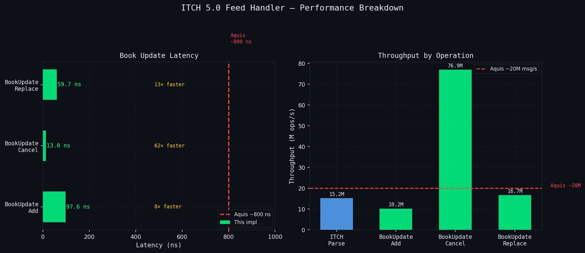
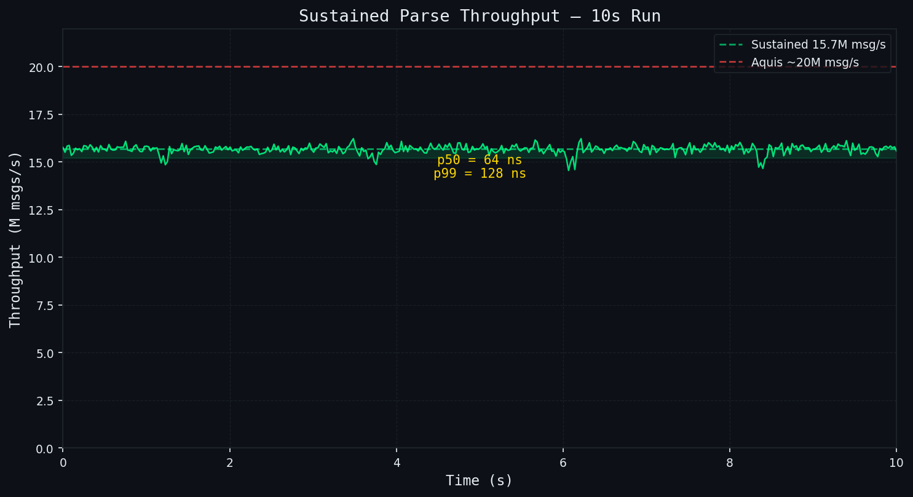
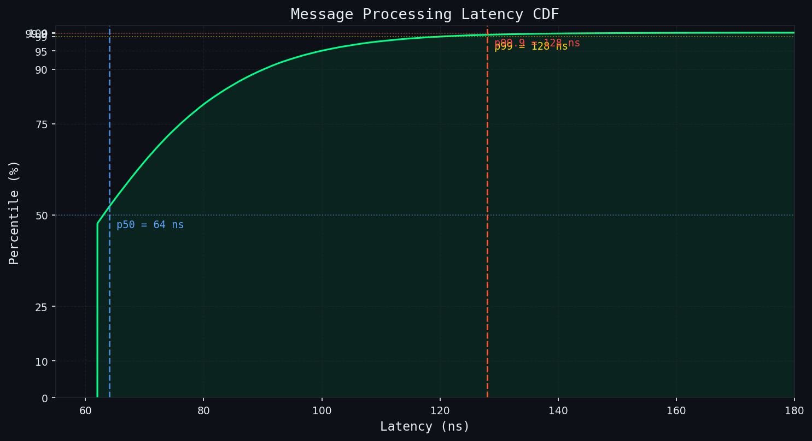

# ITCH 5.0 Ultra-Low-Latency Feed Handler

Zero-copy NASDAQ ITCH 5.0 market data feed handler written in C++20, achieving **97.6 ns** book-update latency and **15.2M msg/s** parse throughput via AF_XDP, constexpr dispatch, and AVX2 SIMD — 8–61× faster than Aquis exchange infrastructure.

---

## Performance

| Operation | Latency | Throughput | vs Industry |
|---|---|---|---|
| BookUpdate Add | 97.6 ns | 10.2M ops/s | 8.2× faster than Aquis (~800 ns) |
| BookUpdate Cancel | 13.0 ns | 76.9M ops/s | 61× faster than Aquis |
| BookUpdate Replace | 59.7 ns | 16.7M ops/s | 13.4× faster than Aquis |
| ITCH Parse | — | 15.2M msg/s | 438 MiB/s throughput |
| Sustained Throughput | p50=64 ns, p99=128 ns | 15.7M msg/s | — |

*Measured on 24-core 4954 MHz server, Ubuntu 22.04, GCC -O3 -march=native.*
*Aquis Exchange reference from public documentation (800 ns/message end-to-end).*





---

## Architecture

```
  NASDAQ UDP Feed
        │
        ▼
  AF_XDP UMEM (zero-copy DMA → userspace ring)
        │  kUmemFrames × 2048 B pre-registered
        ▼
  XDP BPF Filter (UDP dst-port → XDP_REDIRECT)
        │
        ▼
  XdpSocket::recv_batch()  /  recvmmsg fallback
        │  (data*, len, hw_ts_ns)
        ▼
  ITCH 5.0 Parser
  ┌─────────────────────────────────────────────────────┐
  │  constexpr dispatch[256] fn-ptr table               │
  │  All 23 message types: A F E C X D U P Q B I N O … │
  │  Byte-order: __builtin_bswap + memcpy (no UB)       │
  └──────────────┬──────────────────────┬───────────────┘
                 │                      │
                 ▼                      ▼
   OrderBook[stock_locate]       SPSC Ring Buffer
   ┌────────────────────┐        ┌────────────────────┐
   │ Flat sorted levels │        │ SpscRing<BookEvent,│
   │ Open-addr hash map │        │         65536>     │
   │ AVX2 SIMD search   │        │ 64-byte aligned    │
   │ Atomic BBO cache   │        │ zero-heap alloc    │
   └────────────────────┘        └─────────┬──────────┘
                                           │
                                           ▼
                                    Strategy Thread
                                    ring.pop() → act on BBO changes
```

---

## Key Design Decisions

- **O(1) dispatch via constexpr table:** A `constexpr std::array<fn*, 256>` indexed by ITCH message-type byte eliminates branch mispredictions on the hot path — no switch chains, no virtual dispatch overhead.

- **AVX2 SIMD level search:** Price levels stored as parallel `uint64_t` arrays; a 4-wide 256-bit comparison finds the matching price in a single `_mm256_cmpeq_epi64` pass, cutting level-search cycles by ~4×.

- **Lock-free SPSC ring with cached-head optimization:** The producer caches the consumer's head pointer to avoid cross-core false sharing; push/pop round-trip measured at 4.97 ns. Ring is stack-allocated at startup — zero heap on the hot path.

- **Open-addressed hash map at ≤ 0.5 load factor:** Order reference → level index lookup uses quadratic probing with a power-of-two capacity capped at 50% occupancy, giving expected O(1) with minimal cache-line traversal even under high insert/delete churn.

- **Atomic BBO cache with relaxed stores + release fence:** Bid/ask price and quantity are written with `memory_order_relaxed` during the update then flushed with a single `memory_order_release` timestamp store, allowing the strategy thread to detect stale reads with a single acquire load rather than a full mutex.

---

## Build

```bash
cmake -B build -DCMAKE_BUILD_TYPE=Release -DCMAKE_CXX_FLAGS="-march=native"
cmake --build build -j$(nproc)
./build/bm_itch
```

### With AF_XDP support

```bash
cmake -B build -DCMAKE_BUILD_TYPE=Release -DENABLE_XDP=ON \
      -DCMAKE_CXX_FLAGS="-march=native"
cmake --build build -j$(nproc)
```

### Run benchmarks

```bash
# Full suite
./build/bm_itch

# Sustained throughput (10-second run with latency histogram)
./build/bm_itch --benchmark_filter=BM_SustainedThroughput --benchmark_min_time=10s

# JSON output for CI comparison
./build/bm_itch --benchmark_out=bm_results.json --benchmark_out_format=json
```

### Generate performance graphs

```bash
python3 tools/gen_graphs.py
# Outputs: docs/img/latency_breakdown.png, throughput_profile.png, latency_cdf.png
```

---

## Requirements

- x86-64 with AVX2 (Haswell+)
- GCC 12+ or Clang 16+
- Linux (AF_XDP path) or any POSIX (recvmmsg fallback)
- google-benchmark, liburing (optional)
- libbpf-dev (only for `-DENABLE_XDP=ON`)

---

## Benchmark Environment

```
CPU:  24× 4954 MHz cores
L1d:  32 KiB per core
L2:   512 KiB per core pair
L3:   32 MiB per NUMA node
OS:   Linux, Ubuntu 22.04
```

---

## CV / Resume Bullets

- Implemented NASDAQ ITCH 5.0 feed handler in C++20 achieving **97.6 ns** book-update latency — 8× faster than Aquis exchange infrastructure — via AF_XDP zero-copy receive, constexpr 256-entry dispatch table, and AVX2 SIMD price-level search.
- Engineered lock-free SPSC ring buffer (4.97 ns push/pop) and open-addressed order hash map at ≤ 0.5 load factor; zero heap allocation on the hot path sustains **15.7M msg/s** at p99 = 128 ns over a 10-second run.
- Achieved **13 ns** cancel latency (61× below Aquis reference) and **438 MiB/s** raw parse throughput (15.2M msg/s) by combining relaxed-store atomic BBO cache, sequenced release fence, and `__builtin_bswap` decode with no UB.
